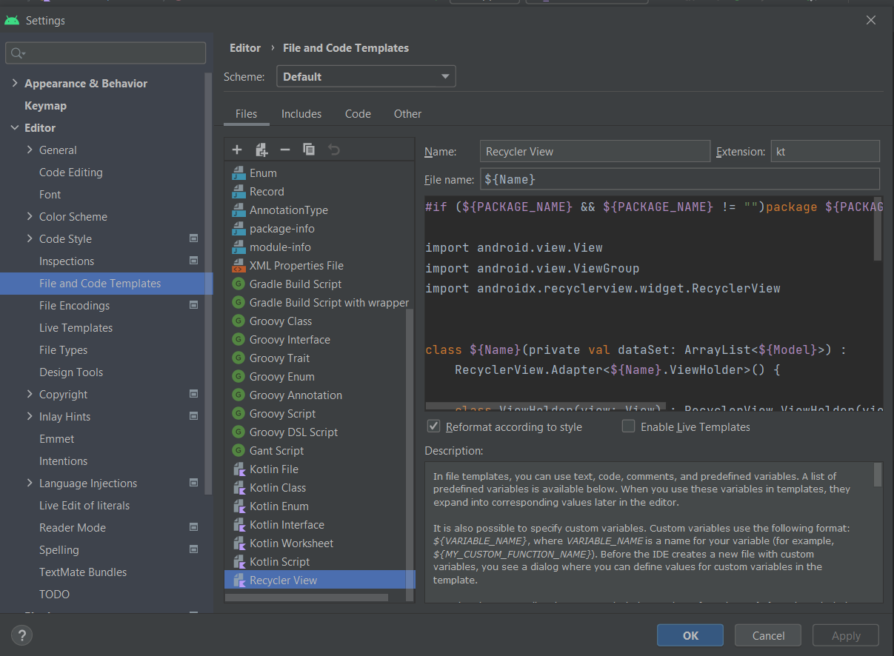

# RecyclerView Template



``` kotlin
#if (${PACKAGE_NAME} && ${PACKAGE_NAME} != "")package ${PACKAGE_NAME};#end

import android.view.View
import android.view.ViewGroup
import androidx.recyclerview.widget.RecyclerView


class ${Name}(private val dataSet: ArrayList<${Model}>) :
    RecyclerView.Adapter<${Name}.ViewHolder>() {

    class ViewHolder(view: View) : RecyclerView.ViewHolder(view) {
        //val textView: TextView

        init {
            //textView = view.findViewBy(R.id.textView)
        }
    }

    override fun onCreateViewHolder(viewGroup: ViewGroup, viewType: Int): ViewHolder {
        //val view = LayoutInflater.from(viewGroup.context).inflate(R.layout.row_item_pack, viewGroup, false)

        //return ViewHolder(view)
    }

    override fun onBindViewHolder(viewHolder: ViewHolder, position: Int) {
        //viewHolder.textView.text = dataSet[position].text"

    }

    override fun getItemCount() = dataSet.size
}
```