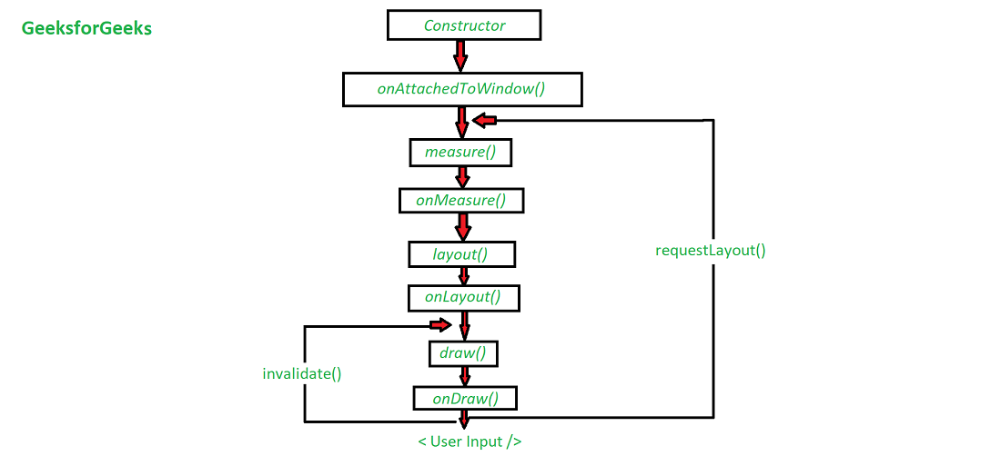

# Custom View

Life Cycle View


``` kotlin title="CustomView.kt"
package com.handemirer.customview

import android.content.Context
import android.graphics.Canvas
import android.graphics.Color
import android.graphics.Paint
import android.text.TextPaint
import android.util.AttributeSet
import android.view.View

class  CustomView @JvmOverloads constructor(
    context: Context,
    attrs: AttributeSet? = null,
    defStyle: Int = 0
) : View(context, attrs, defStyle)
{

    private var _exampleString: String? = null // TODO: use a default from R.string...
    private var _exampleColor: Int = Color.RED // TODO: use a default from R.color...
    private var _exampleDimension: Float = 0f // TODO: use a default from R.dimen...

    private lateinit var textPaint: TextPaint
    private var textWidth: Float = 0f
    private var textHeight: Float = 0f

    var exampleString: String?
        get() = _exampleString
        set(value) {
            _exampleString = value
            invalidateTextPaintAndMeasurements()
        }

    var exampleColor: Int
        get() = _exampleColor
        set(value) {
            _exampleColor = value
            invalidateTextPaintAndMeasurements()
        }

    var exampleDimension: Float
        get() = _exampleDimension
        set(value) {
            _exampleDimension = value
            invalidateTextPaintAndMeasurements()
        }

    init {
        init(attrs,defStyle)
    }

    private fun init(attrs: AttributeSet?, defStyle: Int) {
        val a = context.obtainStyledAttributes(
            attrs, R.styleable.CustomView, defStyle, R.style.Widget_Theme_CustomView_MyView
        )

        _exampleString = a.getString(
            R.styleable.CustomView_exampleString
        )
        _exampleColor = a.getColor(
            R.styleable.CustomView_exampleColor,
            exampleColor
        )

        _exampleDimension = a.getDimension(
            R.styleable.CustomView_exampleDimension,
            exampleDimension
        )

        a.recycle()

        textPaint = TextPaint().apply {
            flags = Paint.ANTI_ALIAS_FLAG
            textAlign = Paint.Align.LEFT
        }

        invalidateTextPaintAndMeasurements()
    }

    private fun invalidateTextPaintAndMeasurements() {
        textPaint.let {
            it.textSize = exampleDimension
            it.color = exampleColor
            textWidth = it.measureText(exampleString)
            textHeight = it.fontMetrics.bottom
        }
    }

    override fun onDraw(canvas: Canvas) {
        super.onDraw(canvas)

        val paddingLeft = paddingLeft
        val paddingTop = paddingTop
        val paddingRight = paddingRight
        val paddingBottom = paddingBottom

        val contentWidth = width - paddingLeft - paddingRight
        val contentHeight = height - paddingTop - paddingBottom

        exampleString?.let {
            canvas.drawText(
                it,
                paddingLeft + (contentWidth - textWidth) / 2,
                paddingTop + (contentHeight + textHeight) / 2,
                textPaint
            )
        }


    }
}
```

``` xml title="attrs_custom_view.xml"
<resources>
    <declare-styleable name="CustomView">
        <attr name="exampleString" format="string" />
        <attr name="exampleDimension" format="dimension" />
        <attr name="exampleColor" format="color" />
    </declare-styleable>
</resources>
```

``` xml title="style.xml"
<resources>
    <style name="Widget.Theme.CustomView.MyView" parent="">
        <item name="android:background">@color/gray_400</item>
        <item name="exampleString">abc</item>
        <item name="exampleDimension">24sp</item>
        <item name="exampleColor">?android:attr/textColorPrimary</item>
    </style>
</resources>
```
