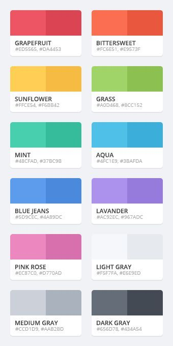

# Flat Colors



``` xml
<?xml version="1.0" encoding="utf-8"?>
<resources>
    <color name="grapefruit">#ED5565</color>
    <color name="grapefruit_shadow">#DA4453</color>
    <color name="bittersweet">#FC6E51</color>
    <color name="bittersweet_shadow">#E9573F</color>
    <color name="sunflower">#FFCE54</color>
    <color name="sunflower_shadow">#F6BB42</color>
    <color name="grass">#A0D468</color>
    <color name="grass_shadow">#8CC152</color>
    <color name="mint">#48CFAD</color>
    <color name="mint_shadow">#37BC9B</color>
    <color name="aqua">#4FC1E9</color>
    <color name="aqua_shadow">#3BAFDA</color>
    <color name="bluejeans">#5D9CEC</color>
    <color name="bluejeans_shadow">#4A98DC</color>
    <color name="lavander">#AC92EC</color>
    <color name="lavander_shadow">#967ADC</color>
    <color name="pinkrose">#EC87C0</color>
    <color name="pinkrose_shadow">#D770AD</color>
    <color name="lightgray">#F5F7FA</color>
    <color name="lightgray_shadow">#E6E9ED</color>
    <color name="mediumgray">#CCD1D9</color>
    <color name="mediumgray_shadow">#AAB2BD</color>
    <color name="darkgray">#656D78</color>
    <color name="darkgray_shadow">#434A54</color>
</resources>
```